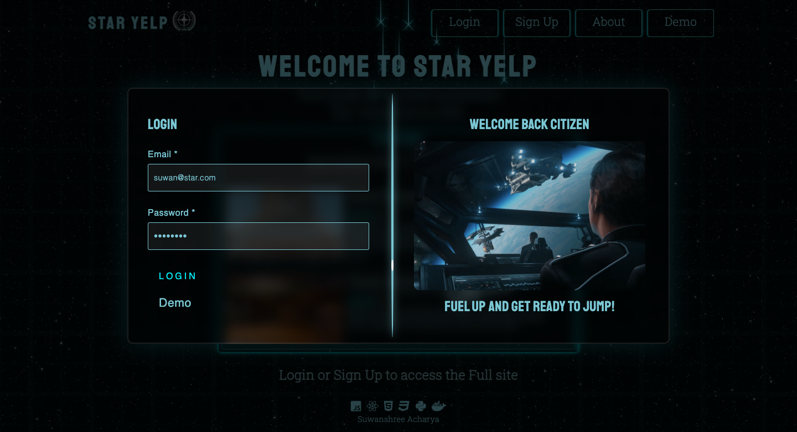

<div id="top"></div>

<!-- PROJECT LOGO -->
<br />
<div align="center">
  <!-- <a href="https://github.com/suwanshree/star-yelp"> -->
    
  </a>

<h2 align="center">STAR YELP</h2>

  <p align="center">
    A portfolio clone of Yelp: https://www.yelp.com/ in the style of RSI Website: https://robertsspaceindustries.com/
    <br />
    <br />
    <a href="https://star-yelp.herokuapp.com/"><strong>Explore the site »</strong></a>
    <br />
    <br />
    <a href="https://github.com/suwanshree/star-yelp/wiki"><strong>Explore the docs »</strong></a>
    <br />
  </p>
</div>


<!-- TABLE OF CONTENTS -->
<details>
  <summary>Table of Contents</summary>
  <ol>
    <li><a href="#about-the-project">About The Project</a></li>
    <li><a href="#key-features">Key Features</a></li>
    <li><a href="#frontend-overview">Frontend Overview</a></li>
    <li><a href="#backend-overview">Backend Overview</a></li>
    <li><a href="#star-yelp-setup">Star Yelp Setup</a></li>
    <li><a href="#usage">Usage</a></li>
    <li><a href="#future-implementations">Future Implementations</a></li>
    <li><a href="#contact">Contact</a></li>
  </ol>
</details>


<!-- ABOUT THE PROJECT -->
## About The Project

Star Yelp, a Yelp clone, is a business/service review website for users to share their listing information with other site users, and also provide feedback in the form of reviews and ratings for listings posted by other users, all in the expansive world of the video game "Star Citizen". Users have the ability to edit and delete their listings after posting, and they can also edit and delete their reviews/ratings. With Star Yelp, say goodbye to wasting precious quantum fuel jumping around the 'verse to meet your best needs, check the reviews then save time and energy!


## Key Features

* Create new users and have user login with authorization
* Once logged in, view all listings & reviews across the site posted by all users
* Post new listings then edit and delete them later if required
* Post new reviews on other listings then edit and delete them later if required

<p align="right">(<a href="#top">back to top</a>)</p>


<!-- BUILT WITH -->
## Frontend Overview

Star Yelp is built on a React frontend and uses an npm package for displaying ratings as stars.

Technologies/Frameworks Used
* [Javascript](https://www.javascript.com)
* [React](https://reactjs.org/)
* [Redux](https://redux.js.org/)
* [HTML](https://developer.mozilla.org/en-US/docs/Web/HTML)
* [CSS](https://developer.mozilla.org/en-US/docs/Web/CSS)
* [react-rating-stars-component](https://github.com/ertanhasani/react-stars)

## Backend Overview

Star Yelp uses a Flask backend and utilizes PostgreSQL as its database. It also uses wtfforms as a form package.

Technologies/Frameworks Used
* [Python](https://www.python.org/)
* [PostgreSQL](https://www.postgresql.org/docs/)
* [Flask](https://flask.palletsprojects.com/en/2.1.x/)
* [Wtfforms](https://wtforms.readthedocs.io/)
* [SQLAlchemy](https://www.sqlalchemy.org/)

The live site is hosted on Heroku using github docker containers.

* [Heroku](https://www.heroku.com)

<p align="right">(<a href="#top">back to top</a>)</p>

## Star Yelp Setup

1. Clone the repository from: https://github.com/suwanshree/star-yelp.git
2. Install dependencies: 
    ```bash
    pipenv install --dev -r dev-requirements.txt && pipenv install -r requirements.txt
    ```

3. Create a **.env** file based on the example with proper settings for your
   development environment.
4. Setup your PostgreSQL user, password and database that matches the **.env** file.
5. Get into your pipenv, migrate your database, seed your database, and run your flask app:

   ```bash
   pipenv shell
   ```

   ```bash
   flask db upgrade
   ```

   ```bash
   flask seed all
   ```

   ```bash
   flask run
   ```
6. To run the React App in development, checkout the [README](./react-app/README.md) inside the `react-app` directory.


<!-- USAGE EXAMPLES -->
## Usage

* Users can signup and login to use Star Yelp, and can also use the demo feature to explore the website quickly.

 


* Once logged in, the user is directed to the listings page, where logged-in users can view a list of all the listings in the website, search for a particular listing by title, and sort the listings by desired category.

 


* Logged in users can create a new listing. It can also be edited and deleted. Users can also view their own listings in their profile page.

 


* Logged in users can click into any individual listing, to enter the single listings page and view all the reviews associated with it.

 


* Once in the single listing page, logged in users can add their own review, if it is not a listing owned by them. Here they can also edit and delete their own review. To be fair to listing owners, users have a limit of one review per listing.

 


<p align="right">(<a href="#top">back to top</a>)</p>


<!-- FUTURE IMPLEMENTATIONS -->

## Future Implementations

* Search Feature - Users can search all listings by providing keywords through a search bar. ✅
* Feedback - Users can provide feedback through a form that sends an email to the site administrator.
* AWS Images - Users can upload multiple images for listings and reviews from their local machine. ✅
* O-Auth integration - Users can choose to login via their google accounts through O-Auth authentication.
* Listing Categories - Listings have categories associated with them which users can filter the main listings page by. ✅
* Expanded User Profiles - User profiles are expanded to show all of the logged in user's listings in one place. ✅

<!-- CONTACT -->
## Contact

Suwanshree Acharya - [GitHub](https://github.com/suwanshree)

Project Repo Link: [https://github.com/suwanshree/star-yelp](https://github.com/suwanshree/star-yelp)

Project Link: [https://star-yelp.herokuapp.com/](https://star-yelp.herokuapp.com/)

<p align="right">(<a href="#top">back to top</a>)</p>
